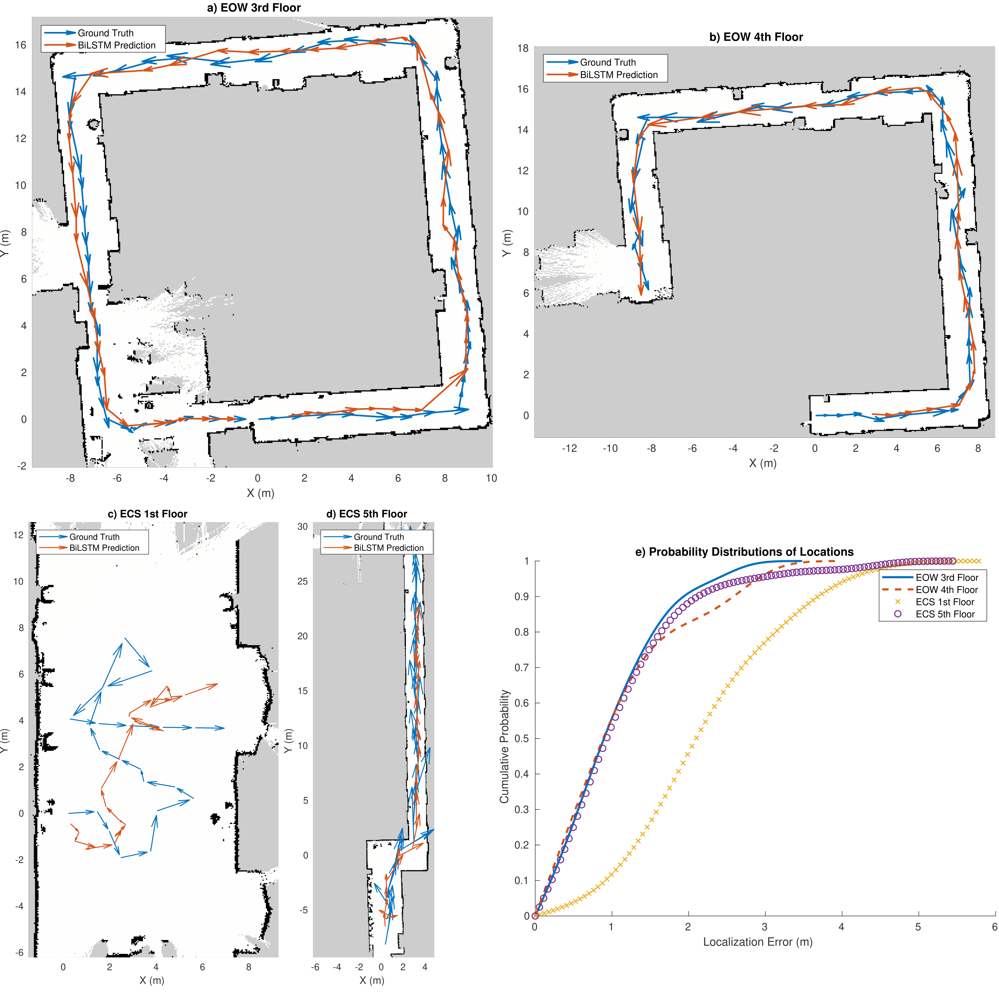

# Wi-Fi BLE RSSI SQI Localization dataset

Wi-Fi BLE RSSI for positioning / Indoor Localization in 4 different locations and using 18 different APs

Data is only measured at the Router Side

Data is not measured at client side

Has 12 datasets inside the zip folder with over 1,000,000 data points

Contains processed Wi-Fi and BLE packets from various routers in:  
1. University of Victoria, Engineering Office Wing (EOW)
2. University of Victoria, Engineering Lab Wing (ELW)
3. University of Victoria, Engineering and Computer Science (ECS)
 
Each folder contains a training dataset and a testing dataset that is independent in time and space

Router Time is synchronized using chrony

Mirror:

https://zenodo.org/records/10862916

# Dataset is in CSV format
Relative Time (seconds) | X Position (meters) | Y Position (meters) | Feature 1 | Feature 2 | Feature 3 .....

Time resets at every new position and position accuracy is a few centimeters using LIDAR and RGBD camera

Map is in ROS2 PGM format that can read by ROS2 programs

Data for the paper

Wi-Fi and Bluetooth Contact Tracing Without User Intervention

https://ieeexplore.ieee.org/document/9866766

